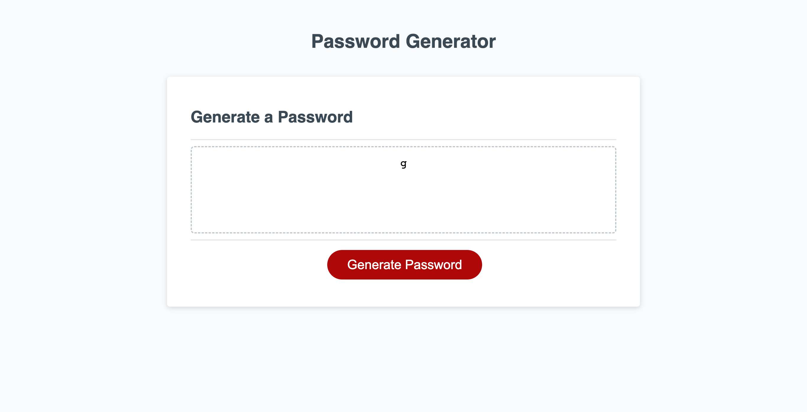

# password-generator

## What i was tasked to do in this project:

- GIVEN I need a new, secure password
- WHEN I click the button to generate a password
- THEN I am presented with a series of prompts for password criteria
- WHEN prompted for password criteria
- THEN I select which criteria to include in the password
- WHEN prompted for the length of the password
- THEN I choose a length of at least 8 characters and no more than 128 characters
- WHEN asked for character types to include in the password
- THEN I confirm whether or not to include lowercase, uppercase, numeric, and/or special characters
- WHEN I answer each prompt
- THEN my input should be validated and at least one character type should be selected
- WHEN all prompts are answered
- THEN a password is generated that matches the selected criteria
- WHEN the password is generated
- THEN the password is either displayed in an alert or written to the page

```

## What I did in this project:

- I created a a prompted to ask user how many characters they want
- prompt to include if they want symbols, numbers, lower and upper case characters with a OK or cancel pop prompt
- I created an object an object and also created arrays with all the characters
- created a password generator using a function, loop and math
- created a responsive website so it can be used with various other devices

## Link

### Deployed url: [https://liban2200.github.io/password-generator/](https://liban2200.github.io/password-generator/) https://liban2200.github.io/password-generator/

### Github url: [https://github.com/liban2200/password-generator/tree/dev](https://github.com/liban2200/password-generator/tree/dev)

## Screenshots

### after:


```
